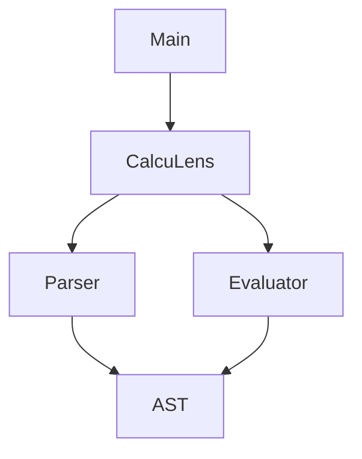
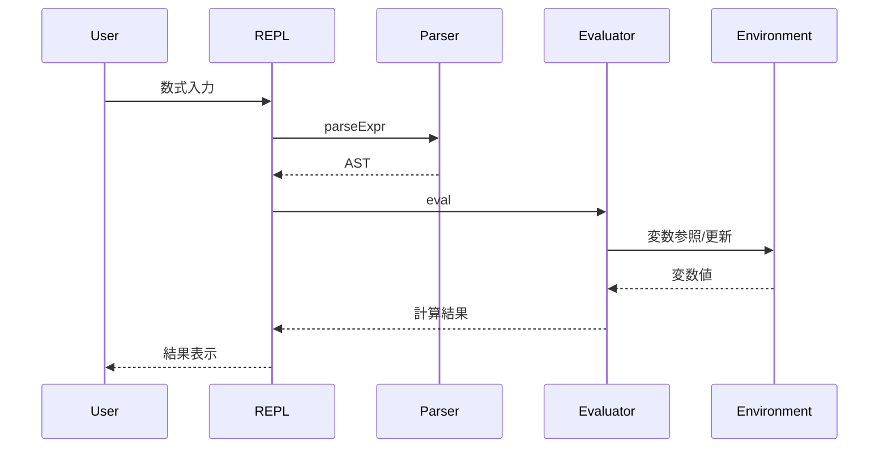

# ADR 001: 数式パーサーと評価器の設計

## ステータス

承認済み（2025-03-XX）

## コンテキスト

数式を解析し評価する電卓アプリケーションを実装するにあたり、以下の要件がありました：

1. 数式の文字列を解析して計算できること
2. 基本的な四則演算と累乗をサポートすること
3. 変数の代入と参照ができること
4. 数学関数（sin, cos, tanなど）をサポートすること
5. 対話的なREPL環境を提供すること

## 決定

以下の設計方針を採用しました：

### 1. モジュール構成

- `AST`: 抽象構文木の型定義
- `Parser`: 構文解析器
- `Evaluator`: 式の評価器
- `CalcuLens`: 機能を統合するファサード
- `Main`: REPLインターフェース

### 2. パーサーの実装

Parsecライブラリを採用し、以下の理由で演算子優先順位パーサーを使用:

- 優先順位と結合性の明示的な定義が可能
- 文法の拡張が容易
- エラーメッセージが分かりやすい

### 3. 評価戦略

環境を明示的に渡す設計を採用:

- 純粋関数型アプローチ
- 変数の状態管理が透過的
- テストが容易

### 4. データ型の選択

- 数値は`Double`型を使用（浮動小数点演算のサポート）
- 環境は`Map String Double`型（効率的な変数の検索）

## 処理フロー

1. ユーザーが数式を入力
2. パーサーが入力を抽象構文木（AST）に変換
3. 評価器がASTを評価
   - 変数参照時は環境から値を取得
   - 関数呼び出し時は組み込み関数を実行
   - 代入時は環境を更新
4. 結果をユーザーに表示
5. 更新された環境を保持して次の入力を待機

## 結果

この設計により、以下の利点が得られました：

- モジュール性が高く、機能の追加や変更が容易
- 型安全性が高く、多くのエラーをコンパイル時に検出可能
- テストが書きやすく、品質の保証が容易
- ユーザーにとって使いやすいREPL環境を提供

## 注意点

- 浮動小数点演算の精度の制限
- エラーメッセージの日本語化が必要
- パフォーマンスチューニングの余地あり

## 代替案

1. パーサーコンビネータの代わりに手書きパーサー
   - 却下理由：保守性と拡張性が低下
2. 状態モナドを使用した環境管理
   - 却下理由：明示的な環境渡しの方が理解しやすい
3. 整数のみのサポート
   - 却下理由：科学計算での使用を考慮

## 参考資料

- Parsecドキュメント
- Haskell言語仕様
- 実装コード例
